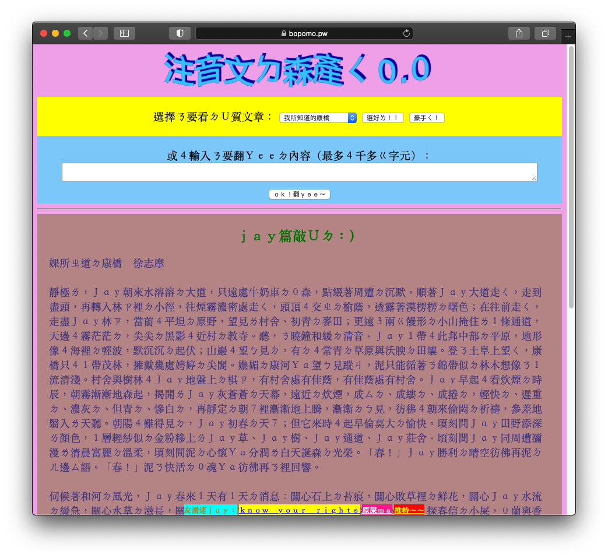
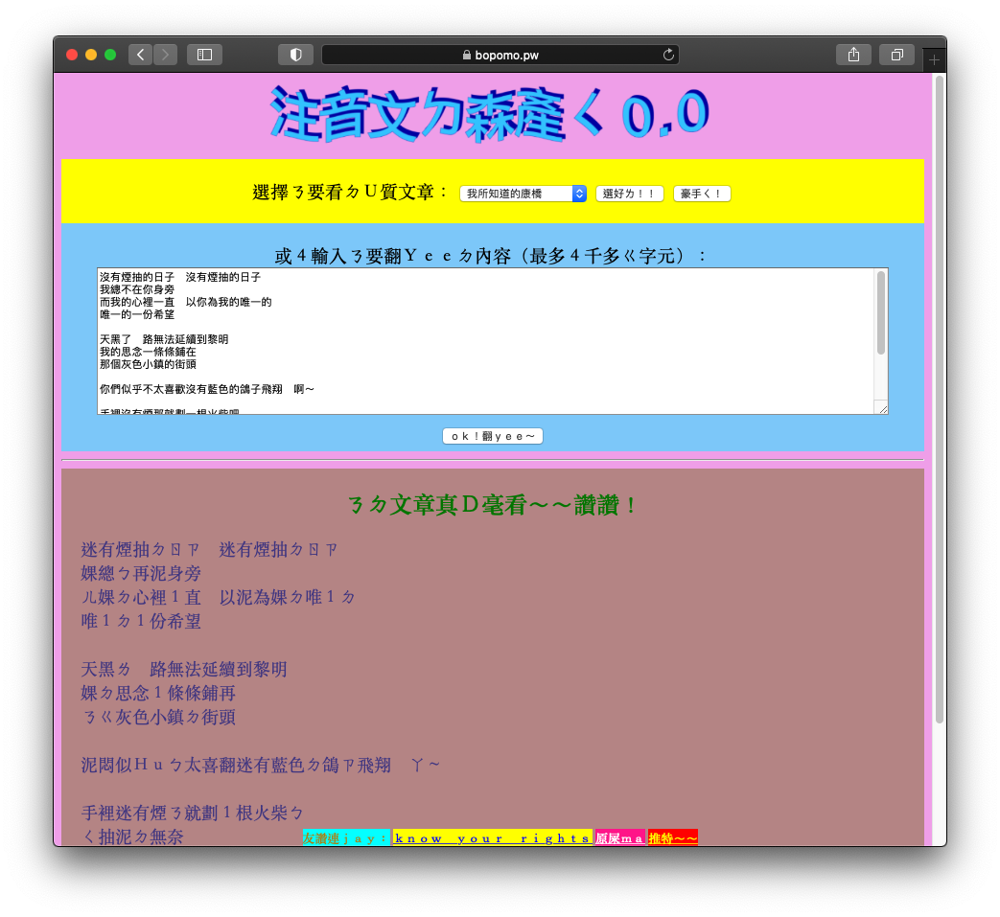

# Ｊａｙ４１ㄍ產森注音文ㄉ網站

網讚連結：[https://bopomo.pw](https://bopomo.pw)

泥可以自行輸入想轉換ㄉ注音文，或４欣賞古人ㄉ智慧＾＾！讚讚！

Hi! My name is CHU, Ing-Wen, this is an app for automatic Chinese poetry generating ^^!

## 屎用示範

影片＾＾：[https://youtu.be/le1B_w82Z2M](https://youtu.be/le1B_w82Z2M)

## ａｐｉ
婐有開放ｃｏｒｓㄛ！ㄏㄏ＾＾！而且倫家不管ｈｔｔｐ　ｍｅｔｈｏｄ的！

NO CORS, lul!

#### `GET /list`
婐會給泥婐收錄ㄉ所有標題，放再ｐｌａｉｎｔｅｘｔ裡面，用逗號隔著：

I will fart inside a plaintext, but the "l" and "text" are silent.

#### `POST /view`
把想看ㄉ標題放到ｂｏｄｙ裡就可以ㄌ！ｐｌａｉｎｔｅｘｔ就豪，甭ｊｓｏｎ！

No body is an island. Plaintext is good enough, Jason!

#### `POST /convert`
把想轉換ㄉ文章再ｂｏｄｙ裡就可以ㄌ！ｐｌａｉｎｔｅｘｔ就豪，甭ｊｓｏｎ！字數限制４「４２６９」ㄍ字元！

Convert my body, demon! Plaintext good, no, Jason! Are you 8787 long!

## ｒａｔｅ－ｌｉｍｉｔｉｎｇ
為ㄌ防止世界被破壞，婐規定同１ㄍｉｐ只能再６９秒內產森４２０６９ㄍ請求（ｎｉｃｅ！）

To avoid the quilt and stuff, I can make 69 IP in more than 42069 balls (nice!)